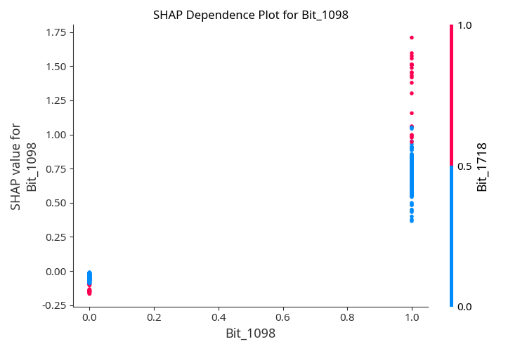

## AI-Driven Analysis of Enzyme Inhibitors: QSAR Modeling for Acetylcholinesterase Inhibitors

**This project is a deliberate experiment in human-AI collaboration.**

The entire initial codebase, data processing pipeline, model training, SHAP explainability analysis, visualizations, and Streamlit application were autonomously generated by the AI agent **Manus** based on detailed instructions provided by me.

I (Semen Gavrilov) then reviewed all scientific decisions, validated the QSAR methodology (especially scaffold splitting and pIC50 calculation), corrected authorship and licensing, refined the documentation, and made final adjustments to ensure professional quality.

## Highlights
- **Target:** Human Acetylcholinesterase (ChEMBL ID: CHEMBL220), a key Alzheimer's target.
- **Dataset:** 5,940 unique compounds curated from ChEMBL with standardized pIC50 values.
- **Features:** Hybrid representation using 200+ RDKit 2D descriptors and 2048-bit Morgan fingerprints.
- **Validation:** Murcko scaffold-based splitting to ensure realistic evaluation of structural generalization.
- **Explainability:** SHAP (SHapley Additive exPlanations) for deep interpretation of molecular drivers of activity.
- **Deployment:** Interactive Streamlit web application for real-time bioactivity prediction.

## Table of Contents
1. [Introduction](#introduction)
2. [Methods](#methods)
3. [Results](#results)
4. [Discussion & Interpretability](#discussion--interpretability)
5. [Limitations](#limitations)
6. [Acknowledgments and Project Origin](#acknowledgments-and-project-origin)
7. [Author and License](#author-and-license)
8. [Citation](#citation)
9. [How to Reproduce](#how-to-reproduce)

## Introduction
Acetylcholinesterase (AChE) is an essential enzyme in the nervous system responsible for the termination of nerve impulse transmission at cholinergic synapses by rapid hydrolysis of acetylcholine. In Alzheimer's disease, a significant loss of cholinergic neurons leads to a deficiency in acetylcholine. AChE inhibitors (AChEIs) are the standard symptomatic treatment, aiming to increase acetylcholine levels. This project applies machine learning to predict the inhibitory potency of small molecules against AChE, facilitating the discovery of novel therapeutic candidates.

## Methods
### Data Curation
- **Source:** ChEMBL database (CHEMBL220).
- **Filtering:** Only human single-protein assays with exact IC50 values in nM were included.
- **Processing:** Salt removal, fragment cleaning, and canonicalization using RDKit.
- **Standardization:** IC50 values were converted to pIC50 ($-\log_{10}[\text{IC50 M}]$). Duplicates were handled by averaging pIC50 values.

### Feature Engineering
- **2D Descriptors:** 200+ physicochemical properties (LogP, MW, TPSA, etc.).
- **Fingerprints:** 2048-bit Morgan fingerprints (radius=2).
- **Selection:** Variance thresholding and removal of highly correlated features (>0.95) based on the training set.

### Data Splitting
- **Murcko Scaffold Split:** Compounds were split into training (80%) and test (20%) sets based on their molecular scaffolds. This prevents "similarity leakage" and provides a more realistic assessment of the model's ability to predict novel chemical classes.

### Modeling
- **XGBoost Regressor:** Optimized using Optuna for pIC50 prediction.
- **XGBoost Classifier:** For binary activity classification (active if pIC50 ≥ 6.0).

## Results
The models demonstrate robust performance on the scaffold-split test set:

| Task | Metric | Value |
|------|--------|-------|
| **Regression** | R² Score | 0.510 |
| **Regression** | RMSE | 1.058 |
| **Regression** | MAE | 0.798 |
| **Classification** | ROC-AUC | 0.855 |
| **Classification** | Balanced Accuracy | 0.777 |

### Visualizations
#### Actual vs Predicted pIC50


#### SHAP Summary Plot


#### Chemical Space (PCA)


## Discussion & Interpretability
SHAP analysis provides insights into the molecular features driving AChE inhibition:
- **Top Features:** The model relies on a mix of structural bits (e.g., `Bit_1098`) and physicochemical descriptors like `BalabanJ` (topological index) and `SlogP_VSA1` (lipophilicity/surface area).
- **Lipophilicity (LogP):** Features related to LogP and VSA (Van der Waals Surface Area) show that moderately lipophilic compounds with specific surface area distributions are preferred for binding in the AChE gorge.
- **Molecular Shape:** The importance of `BalabanJ` suggests that the degree of branching and molecular shape are critical for fitting into the narrow, deep active site of the enzyme.

#### SHAP Dependence Plot (Top Feature)


## Limitations
- **2D Descriptors:** The model does not account for 3D conformations or stereochemistry, which are vital for specific enzyme-ligand interactions.
- **Activity Cliffs:** Small structural changes can lead to large changes in activity that 2D fingerprints might not fully capture.
- **Data Bias:** ChEMBL data is biased toward published, drug-like chemical series, potentially limiting the applicability domain for entirely novel scaffolds.

## Acknowledgments and Project Origin
This project was developed as a benchmark for autonomous AI agents in scientific research. The entire pipeline—from data retrieval to model deployment—was constructed by **Manus**, an AI agent, following a single comprehensive prompt. This demonstrates the potential of AI to accelerate drug discovery workflows by automating routine data science and cheminformatics tasks.

## Author and License
- **Author:** Semen Gavrilov
- **License:** MIT

## Citation
```bibtex
@misc{gavrilov2026acheqsar,
  author = {Semen Gavrilov},
  title = {AI-Driven Analysis of Enzyme Inhibitors: QSAR Modeling for Acetylcholinesterase Inhibitors},
  year = {2026},
  publisher = {GitHub},
  journal = {GitHub repository},
  howpublished = {\url{https://github.com/segavr/ache-qsar-xgboost-shap}},
  note = {Built with autonomous assistance from Manus AI agent; final review and refinements by the repository owner}
}
```

## How to Reproduce
1. Clone the repository: `git clone https://github.com/segavr/ache-qsar-xgboost-shap`
2. Install dependencies: `pip install -r requirements.txt`
3. Run the pipeline:
   - `python fetch_data_chunks.py`
   - `python process_raw_data_v2.py`
   - `python feature_engineering_v2.py`
   - `python train_models.py`
4. Launch the app: `streamlit run streamlit_app.py`
