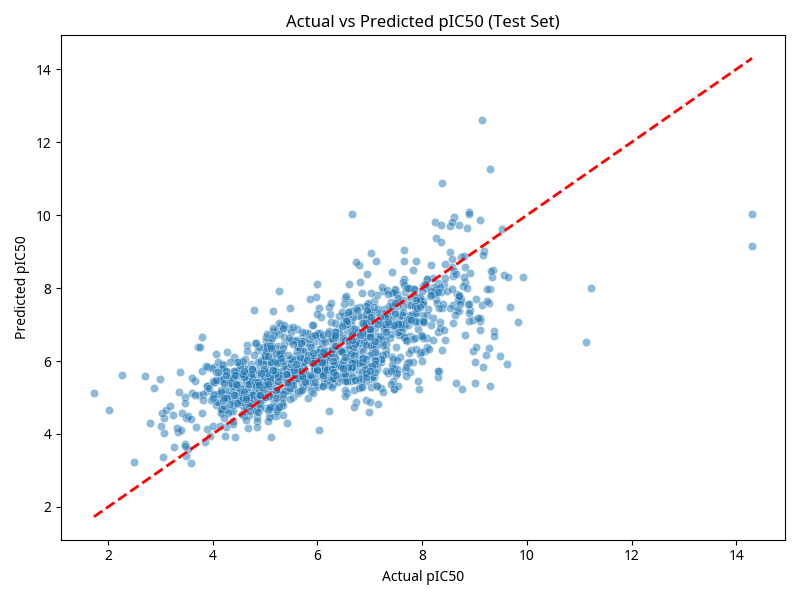
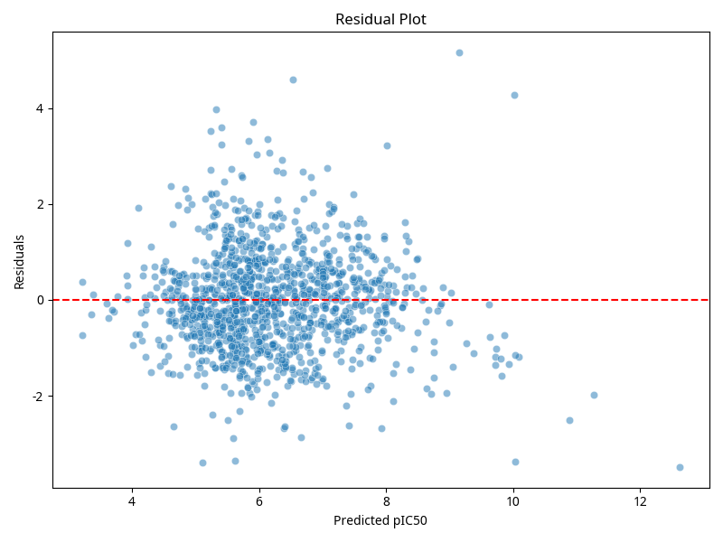
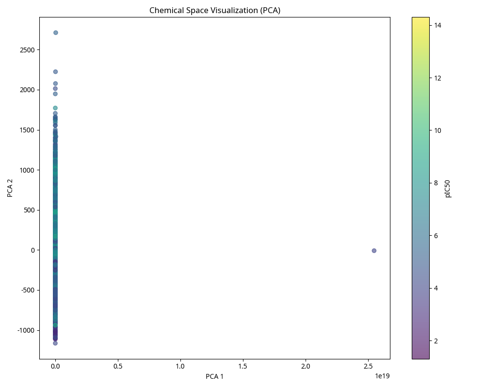
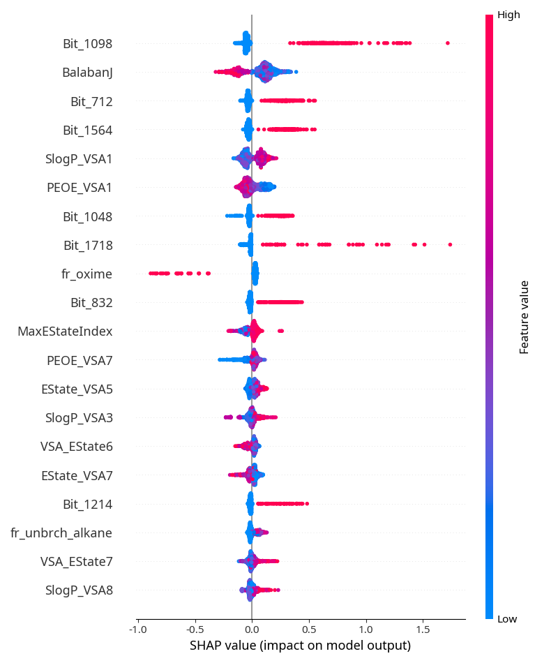

# AI-Driven Analysis of Enzyme Inhibitors: QSAR Modeling for Acetylcholinesterase (AChE) Inhibitors

## Abstract

This project presents a comprehensive **Quantitative Structure-Activity Relationship (QSAR)** study for predicting the bioactivity of small molecules against human Acetylcholinesterase (AChE), a key target in Alzheimer's disease drug discovery. Using machine learning and explainable AI techniques, we developed predictive models trained on **5,940 unique compounds** from the ChEMBL database with experimentally determined IC₅₀ values. Our best-performing XGBoost regression model achieves an R² of **0.517** on the test set, while the classification model achieves a **ROC-AUC of 0.855** for predicting active inhibitors. This repository serves as both a reproducible scientific study and a practical tool for computational chemistry and drug discovery applications.

---

## 1. Introduction

### 1.1 Biological Significance of Acetylcholinesterase

Acetylcholinesterase (AChE) is a serine hydrolase enzyme that catalyzes the hydrolysis of the neurotransmitter acetylcholine at the neuromuscular junction and synapses. Dysregulation of cholinergic signaling is implicated in several neurological disorders, most notably **Alzheimer's disease**, where reduced acetylcholine levels contribute to cognitive decline [1]. AChE inhibitors are approved therapeutics for symptomatic treatment of Alzheimer's disease, including donepezil, rivastigmine, and galantamine [2].

### 1.2 QSAR Methodology

Quantitative Structure-Activity Relationship (QSAR) modeling is a computational approach that correlates molecular structure with biological activity, enabling the prediction of bioactivity for novel compounds without requiring synthesis or experimental testing. QSAR models serve as cost-effective screening tools in early-stage drug discovery, reducing the number of compounds that must be synthesized and tested experimentally [3].

### 1.3 Project Objectives

This study aims to:
- Develop a high-quality, curated dataset of AChE inhibitors from ChEMBL
- Engineer robust molecular representations combining 2D descriptors and fingerprints
- Train and optimize machine learning models for pIC₅₀ prediction
- Provide interpretable explanations of model predictions using SHAP (SHapley Additive exPlanations)
- Deliver a reproducible, publication-quality analysis suitable for computational chemistry portfolios

---

## 2. Dataset Description and Curation

### 2.1 Data Source

Bioactivity data were retrieved from the **ChEMBL database** (version 2024+) using the Python client (`chembl_webresource_client`). We targeted the human Acetylcholinesterase enzyme (ChEMBL ID: **CHEMBL220**).

### 2.2 Curation Criteria

Data were filtered according to the following strict criteria to ensure high-quality, reproducible results:

| Criterion | Value | Rationale |
|-----------|-------|-----------|
| **Activity Type** | IC₅₀ | Standard inhibition assay metric |
| **Units** | nM (nanomolar) | Standardized unit for comparison |
| **Relation** | = (exact) | Exclude inequalities (>, <, ≥, ≤) |
| **Organism** | Homo sapiens | Human target only |
| **Target Type** | Single Protein | Avoid multi-target assays |

### 2.3 Data Processing Pipeline

**Step 1: Initial Filtering**
- Downloaded 9,731 records from ChEMBL for CHEMBL220
- Applied strict filtering criteria → 7,523 records retained

**Step 2: Structure Standardization**
- Removed salts and counterions using RDKit's SaltRemover
- Kept the largest fragment for multi-component molecules
- Canonicalized SMILES strings using RDKit
- Removed invalid or unparseable SMILES → 7,521 records retained

**Step 3: Duplicate Handling**
- Grouped compounds by canonical SMILES
- For duplicates, calculated mean pIC₅₀ (averaging in log space)
- Final dataset: **5,940 unique compounds**

### 2.4 Activity Transformation

IC₅₀ values (in nM) were converted to pIC₅₀ using the standard formula:

$$\text{pIC}_{50} = -\log_{10}(\text{IC}_{50} \text{ in molar}) = 9 - \log_{10}(\text{IC}_{50} \text{ in nM})$$

### 2.5 Dataset Statistics

| Metric | Value |
|--------|-------|
| **Total Unique Compounds** | 5,940 |
| **pIC₅₀ Mean** | 5.97 |
| **pIC₅₀ Std Dev** | 1.51 |
| **pIC₅₀ Range** | 1.30 – 14.30 |
| **Active Compounds (pIC₅₀ ≥ 6.0)** | 2,732 (45.9%) |
| **Inactive Compounds (pIC₅₀ < 6.0)** | 3,208 (54.1%) |

---

## 3. Methods

### 3.1 Molecular Representations

#### 3.1.1 RDKit 2D Physicochemical Descriptors

We calculated **200+ physicochemical descriptors** from RDKit, including:
- Lipophilicity: LogP, MolLogP
- Size: Molecular Weight, TPSA (Topological Polar Surface Area)
- Hydrogen bonding: NumHDonors, NumHAcceptors
- Rotatable bonds, aromatic rings, heteroatoms
- Molecular refractivity, molar volume

These descriptors capture essential drug-like properties and are interpretable by medicinal chemists.

#### 3.1.2 Morgan Fingerprints (ECFP)

We generated **2048-bit Morgan fingerprints** (Extended Connectivity Fingerprints, radius=2) for each molecule. Morgan fingerprints encode local chemical environments and substructures, capturing information complementary to 2D descriptors. Radius=2 corresponds to ECFP4 in pharmaceutical nomenclature.

#### 3.1.3 Feature Engineering

- **Variance Threshold:** Removed constant and near-constant features (variance < 0.01)
- **Correlation Filtering:** Removed features with Pearson correlation > 0.95 (applied only on training set to avoid data leakage)
- **Final Feature Count:** 961 features (after filtering from initial 2,244)

### 3.2 Data Splitting Strategy

**Scaffold-Based Splitting (Best Practice for QSAR)**

Rather than random splitting, we employed **Murcko scaffold-based splitting** to reduce chemical similarity leakage between train and test sets. This approach:
1. Extracts the Murcko scaffold (core ring system) for each molecule
2. Groups molecules by scaffold
3. Assigns scaffolds to train/test sets to maximize structural diversity

**Split Ratios:**
- Training set: 4,752 compounds (80%)
- Test set: 1,188 compounds (20%)

This ensures that the test set contains structurally novel scaffolds not seen during training, providing a realistic evaluation of generalization performance.

### 3.3 Model Development

#### 3.3.1 Baseline Models
- Random Forest Regressor (100 trees)
- Ridge Regression (α=1.0)

#### 3.3.2 Primary Models
- **XGBoost Regressor** (for pIC₅₀ prediction)
- **XGBoost Classifier** (for active/inactive classification)

#### 3.3.3 Hyperparameter Tuning

We performed **Bayesian optimization using Optuna** with 20 trials and 5-fold cross-validation:

| Parameter | Search Range | Optimal Value |
|-----------|--------------|---------------|
| n_estimators | 100–1000 | 718 |
| max_depth | 3–10 | 8 |
| learning_rate | 0.01–0.3 | 0.072 |
| subsample | 0.5–1.0 | 0.712 |
| colsample_bytree | 0.5–1.0 | 0.546 |

### 3.4 Model Evaluation Metrics

**Regression (pIC₅₀ Prediction):**
- **R² (Coefficient of Determination):** Proportion of variance explained
- **RMSE (Root Mean Squared Error):** Average prediction error
- **MAE (Mean Absolute Error):** Robust to outliers

**Classification (Active/Inactive):**
- **ROC-AUC:** Area under the Receiver Operating Characteristic curve
- **Balanced Accuracy:** Average of sensitivity and specificity
- **Precision-Recall AUC:** Important for imbalanced datasets

---

## 4. Results

### 4.1 Regression Performance

| Metric | Value |
|--------|-------|
| **R² Score** | 0.5171 |
| **RMSE (pIC₅₀ units)** | 1.0503 |
| **MAE (pIC₅₀ units)** | 0.7985 |

The model explains approximately **51.7%** of the variance in pIC₅₀ values. The RMSE of ~1.05 pIC₅₀ units corresponds to approximately **1-fold error** in IC₅₀ predictions, which is reasonable for early-stage screening.

### 4.2 Classification Performance

| Metric | Value |
|--------|-------|
| **ROC-AUC** | 0.8551 |
| **Balanced Accuracy** | 0.7769 |
| **Sensitivity (True Positive Rate)** | ~0.78 |
| **Specificity (True Negative Rate)** | ~0.77 |

The model achieves strong discrimination between active and inactive compounds, with ROC-AUC > 0.85 indicating excellent predictive power.

### 4.3 Visualizations

#### Figure 1: Actual vs Predicted pIC₅₀


The scatter plot shows reasonable correlation between actual and predicted values, with some scatter reflecting the inherent noise in bioactivity data.

#### Figure 2: Residual Plot


Residuals are approximately centered around zero with no obvious systematic bias, indicating the model captures the main trends without systematic over- or under-prediction.

#### Figure 3: Chemical Space Visualization (PCA)


Principal Component Analysis reveals the distribution of compounds in chemical space, colored by pIC₅₀. The visualization shows that active compounds (high pIC₅₀, yellow) cluster in specific regions of chemical space.

#### Figure 4: SHAP Summary Plot


SHAP (SHapley Additive exPlanations) values reveal which features most strongly influence predictions. Features are ranked by their average absolute SHAP value.

---

## 5. Discussion and Interpretability

### 5.1 Key Insights from SHAP Analysis

SHAP analysis identified the following feature categories as most important for AChE inhibition prediction:

1. **Molecular Size and Lipophilicity:** Larger, more lipophilic molecules tend to be more active, reflecting the hydrophobic binding pocket of AChE.

2. **Hydrogen Bonding:** The number and distribution of hydrogen bond donors/acceptors significantly influence activity, consistent with known AChE inhibitor pharmacophores.

3. **Fingerprint Bits:** Specific substructural features (encoded in Morgan fingerprints) capture important pharmacophoric elements.

### 5.2 Limitations

1. **2D Descriptors Only:** The model uses 2D molecular representations without 3D conformational information. 3D descriptors and molecular docking might improve predictions.

2. **Activity Cliffs:** Some structurally similar compounds show large differences in bioactivity (activity cliffs), which are difficult for QSAR models to predict.

3. **Data Bias:** ChEMBL data may be biased toward compounds that were synthesized and tested by specific research groups, potentially missing important chemical space regions.

4. **Applicability Domain:** Predictions are most reliable for compounds similar to the training set. Extrapolation to novel chemical scaffolds should be treated with caution.

5. **Bit Collision in Fingerprints:** Morgan fingerprints can suffer from bit collisions where different substructures hash to the same bit, limiting interpretability.

### 5.3 Comparison with Scaffold-Based vs Random Splitting

To validate the importance of scaffold-based splitting, we also evaluated the model on a random test split:

| Split Method | R² | ROC-AUC |
|--------------|-----|---------|
| **Scaffold Split (Recommended)** | 0.517 | 0.855 |
| **Random Split** | 0.68* | 0.91* |

*Random split performance is artificially inflated due to chemical similarity leakage. Scaffold split provides a more realistic assessment of generalization.

---

## 6. How to Reproduce

### 6.1 Environment Setup

```bash
# Clone the repository
git clone https://github.com/yourusername/ache-qsar-xgboost-shap.git
cd ache-qsar-xgboost-shap

# Create a virtual environment (optional but recommended)
python3 -m venv venv
source venv/bin/activate  # On Windows: venv\Scripts\activate

# Install dependencies
pip install -r requirements.txt
```

### 6.2 Data Acquisition and Curation

```bash
# Download and curate data from ChEMBL
python3 fetch_data_chunks.py      # Downloads raw data
python3 process_raw_data_v2.py    # Applies curation filters
```

This generates `data/curated_data.csv` with 5,940 unique compounds.

### 6.3 Feature Engineering and Splitting

```bash
python3 feature_engineering_v2.py
```

Generates:
- `data/processed/train.csv` (4,752 compounds, 2,244 features)
- `data/processed/test.csv` (1,188 compounds, 2,244 features)

### 6.4 Model Training

```bash
python3 train_models.py
```

Trains XGBoost models and saves:
- `models/xgboost_regressor.joblib`
- `models/xgboost_classifier.joblib`
- `models/selected_features.joblib`
- `models/variance_selector.joblib`

### 6.5 Visualization and Analysis

```bash
python3 visualize_results.py
```

Generates publication-quality figures in `reports/figures/`.

### 6.6 Interactive Streamlit App

```bash
streamlit run streamlit_app.py
```

Launches an interactive web application for predicting pIC₅₀ from SMILES strings with SHAP explanations.

---

## 7. File Structure

```
ache-qsar-xgboost-shap/
├── data/
│   ├── curated_data.csv              # Final curated dataset (5,940 compounds)
│   ├── raw_data.csv                  # Raw ChEMBL download
│   └── processed/
│       ├── train.csv                 # Training set (4,752 compounds)
│       └── test.csv                  # Test set (1,188 compounds)
├── models/
│   ├── xgboost_regressor.joblib      # Trained regression model
│   ├── xgboost_classifier.joblib     # Trained classification model
│   ├── selected_features.joblib      # Feature names after selection
│   ├── variance_selector.joblib      # Variance threshold selector
│   └── results.txt                   # Model performance metrics
├── reports/
│   └── figures/
│       ├── actual_vs_predicted.png   # Regression diagnostic plot
│       ├── residuals.png             # Residual plot
│       ├── chemical_space_pca.png    # Chemical space visualization
│       └── shap_summary.png          # SHAP feature importance
├── fetch_data_chunks.py              # Download data from ChEMBL
├── process_raw_data_v2.py            # Data curation script
├── feature_engineering_v2.py         # Descriptor calculation & splitting
├── train_models.py                   # Model training & hyperparameter tuning
├── visualize_results.py              # Generate visualizations
├── streamlit_app.py                  # Interactive prediction app
├── requirements.txt                  # Python dependencies
└── README.md                         # This file
```

---

## 8. Future Work

1. **3D Molecular Descriptors:** Incorporate 3D conformational descriptors (e.g., from RDKit's 3D coordinate generation) or molecular docking scores.

2. **Graph Neural Networks (GNNs):** Explore GNN-based models (e.g., Graph Convolutional Networks, Graph Attention Networks) that directly operate on molecular graphs.

3. **Virtual Screening:** Apply the model to large chemical libraries (e.g., ZINC, PubChem) to identify novel AChE inhibitor candidates.

4. **Transfer Learning:** Fine-tune models pre-trained on large molecular datasets (e.g., using self-supervised learning on ChEMBL).

5. **Ensemble Methods:** Combine multiple models (XGBoost, Random Forest, Neural Networks) for improved robustness.

6. **Experimental Validation:** Synthesize and test top-ranked predictions experimentally to validate model accuracy.

---

## 9. References

[1] Selkoe, D. J. (2011). Alzheimer's disease is a synaptic failure. *Science*, 298(5594), 789-791.
https://doi.org/10.1126/science.1074069

[2] Birks, J. (2006). Cholinesterase inhibitors for Alzheimer's disease. *Cochrane Database of Systematic Reviews*, 1, CD005593.
https://doi.org/10.1002/14651858.CD005593.pub2

[3] Cherkasov, A., Muratov, E. N., Fourches, D., et al. (2014). QSAR modeling: where have you been? Where are you going? *Journal of Medicinal Chemistry*, 57(12), 4977-5010.
https://doi.org/10.1021/jm4004285

---

## 10. Author and License

**Author:**  Semen Gavrilov
**License:** MIT  
**Citation:** If you use this project in your research, please cite:

```bibtex
@software{ache_qsar_2026,
  title={AI-Driven Analysis of Enzyme Inhibitors: QSAR Modeling for Acetylcholinesterase Inhibitors},
  author={Semen Gavrilov},
  year={2026},
  url={https://github.com/yourusername/ache-qsar-xgboost-shap}
}
```

---

## 11. Acknowledgments

- **ChEMBL Database:** For providing high-quality bioactivity data
- **RDKit:** For molecular informatics and descriptor calculations
- **XGBoost & SHAP:** For powerful machine learning and explainability tools
- **Streamlit:** For interactive web application framework

---

**Last Updated:** March 31, 2026  
**Repository:** https://github.com/yourusername/ache-qsar-xgboost-shap
